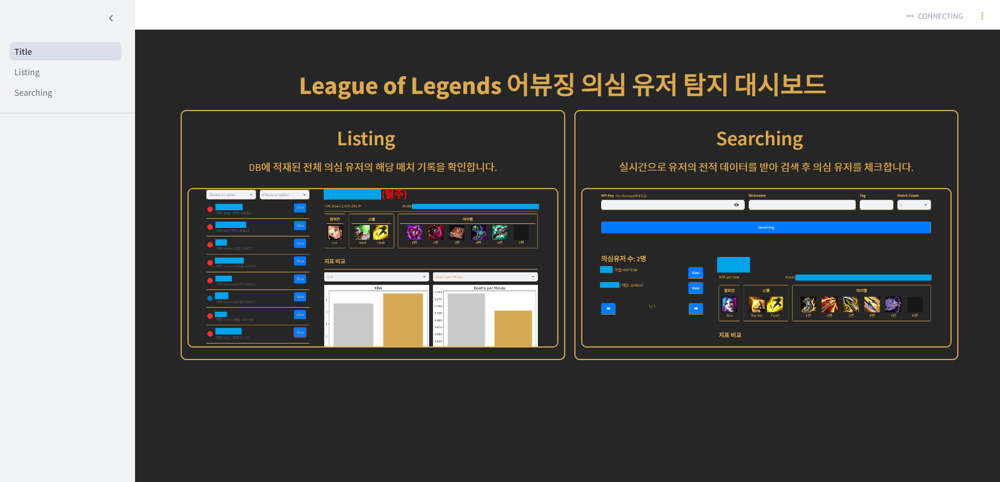
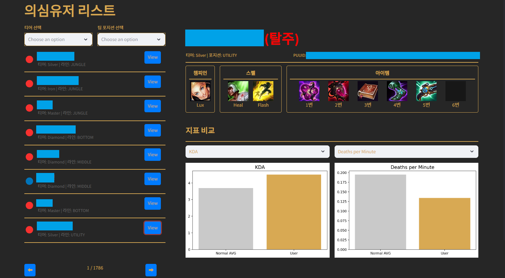
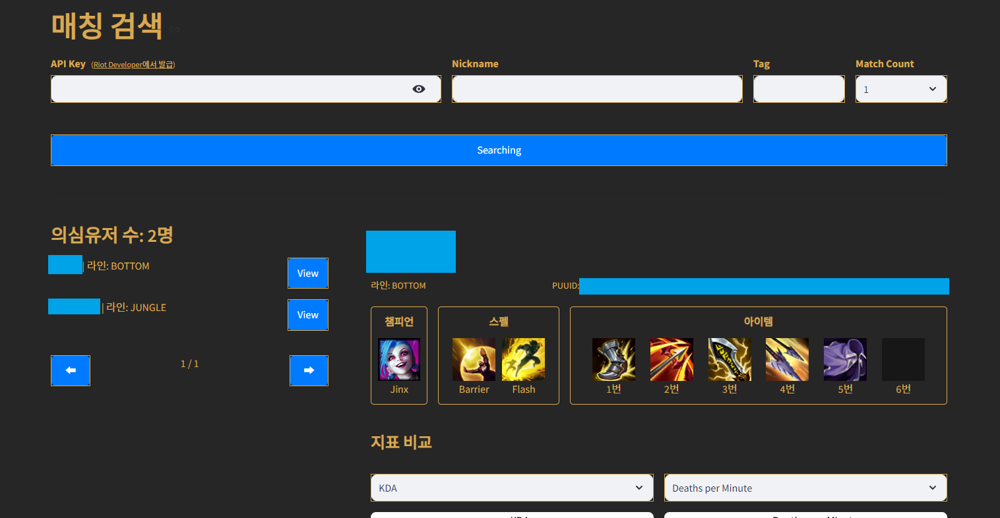

# 🛡️ LoL Troll Detection Project 🛡️
**League of Legends**에서 의심 유저를 탐지하고, 다양한 지표를 통해 분석하는 대시보드입니다.

---

## ⚠️ **주의사항** ⚠️
- 100% 정확하지 않을 수 있으니 **맹신하지 말고 참고 용도로만** 사용해주세요! 
- **특정 유저를 비난하거나 제재하는 용도**가 아닙니다.  
- **익명화 처리:**  
  - **Listing 페이지:** CSV 파일에서 닉네임과 PUUID를 익명화.  
  - **Searching 페이지:** 검색 시 **디스플레이 직전에 익명화** 처리.  

---

## 🖼️ **프로젝트 스크린샷**

### 📋 **메인 화면**

- **프로젝트의 첫 화면**으로, Listing과 Searching 기능을 안내합니다.

---

### 📋 **Listing 페이지**

- **CSV 파일에 적재된 의심 유저** 목록을 분석합니다.  
- **익명화 처리:**  
  - 닉네임과 PUUID는 **고유 난수로 변환**하여 표시됩니다.  
- **다양한 지표**를 통해 유저를 분석할 수 있습니다.

---

### 📋 **Searching 페이지**

- **실시간 전적 조회**를 통해 의심 유저를 탐지합니다.  
- **익명화 처리:**  
  - 닉네임과 PUUID는 **디스플레이 직전에 익명화**됩니다.  
- **API Key 필요:**  
  - Riot Developer에서 발급받은 API Key를 사용해 전적을 조회합니다.  

---

## 📥 **Clone 받는 법**

### **레포지토리 클론**
```bash
git clone 'https://github.com/GwangAnLeeDunKinDonass/LoL_Troll_Detection_Project.git'
```

### ⚠️ **Model & Data 다운로드 방법 (LFS 사용 안됨)**

1. **구글 드라이브에서 `models_and_data.zip` [다운로드](https://drive.google.com/file/d/1IU8jBlGDMmaouHl26G3ufmls0_UqVvpz/view?usp=sharing)**.  
2. 다운로드한 `models_and_data.zip`을 프로젝트 루트 (`LoL_Troll_Detection_Project`)에 **압축 해제**하세요.  
3. **폴더 구조**가 아래와 같아야 합니다:

```
LoL_Troll_Detection_Project/
├── data/
├── model/
├── img/
├── Start.py
├── ...
```

---

## 🚀 **실행 방법**

### 1. **가상환경 설정 (선택)**
```bash
python -m venv venv
source venv/bin/activate  # Mac/Linux
venv\Scripts\activate     # Windows
```

### 2. **필요 패키지 설치**

```bash
pip install -r requirements.txt
```

### 3. **Streamlit 실행**
```bash
streamlit run Title.py
```

---

## 🛠️ **사용된 기술 스택**
- **GUI:** Streamlit  
- **백엔드:** Python
- **모델:** PCA, OCSVM, Isolation Forest

---

## 참고 자료

### 📄 **PPT 자료**
- **프로젝트 설명 자료:**  
  - [📑 PPT 보기](./img/ppt.pdf)  

### 🔗 **참고 링크**
- [Riot Developer Portal](https://developer.riotgames.com/)
- [Streamlit 공식 문서](https://docs.streamlit.io/)

---

## 📌 **주의사항**
- **API Key 노출 주의!**  
  - `Searching` 페이지에서 사용할 **Riot API Key**는 노출되지 않도록 유의해 주세요.
- **이 프로젝트는 연구 및 학습 목적**으로 제작되었습니다.  

---

**문의사항**은 Issue로 남겨주세요! 🙌
